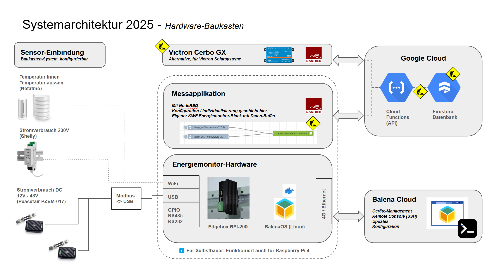
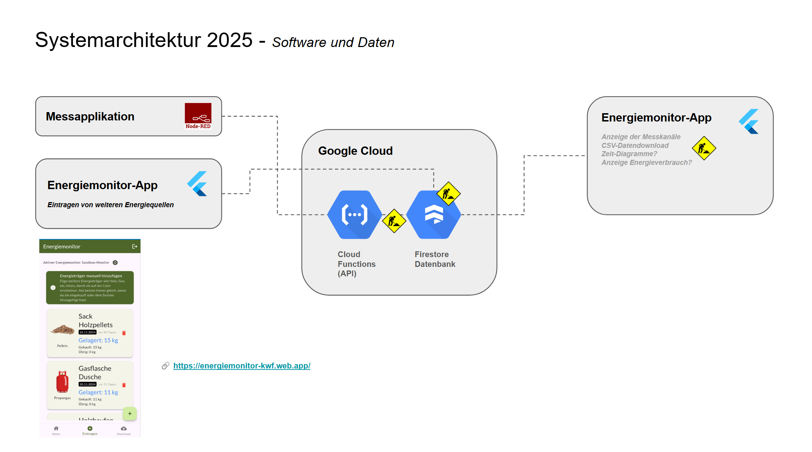

# Das Projekt Energiemonitor
Dieses Projekt soll es dir ermöglichen, deinen Energieverbrauch zu messen, in Echtzeit zu analysieren, zu verstehen und zu optimieren - mit dem Ziel dass du mit den einfachen aber richtigen Aktionen im Alltag 20% deines Energieverbrauchs einsparen kannst. Dieses Projekt wird vom [Verein Kleinwohnformen](https://kleinwohnformen.ch) getragen und ist in erster Linie auf kleine, unabhängige Wohnformen zugeschnitten. Es ist aber nicht ausgeschlossen, dass du unseren Monitor auch für deine Wohnung bauen und nutzen kannst - wir sind Open Source und Mitmachen im Projekt ist erwünscht! Einfach melden beim [Energiemonitor-Team](mailto:energiemonitor@kleinwohnformen.ch).

## Projekt-Repos
- [Referenz-HW und Provisionierung mit BalenaOS](https://github.com/Verein-Kleinwohnformen/energiemonitor-balena-nodered)
- [NodeRED-Connector neu](https://github.com/Verein-Kleinwohnformen/kwf-energiemonitor-db)
- [NodeRED Beispiel-Flows (depr.)](https://github.com/Verein-Kleinwohnformen/energiemonitor-nodered-flows)
- [Energiemonitor-App (Repo)](https://github.com/Verein-Kleinwohnformen/energiemonitor-app)
- [Energiemonitor-App (Demo)](https://energiemonitor-kwf.web.app/)

## Angestrebte Architektur
Wir befinden uns noch in der Designphase, viele der eingezeichneten Komponenten existieren noch nicht. Wir streben aber das folgende System an:





# Balena Image fürs Energiemonitor-Projekt

Dieses Repository beinhaltet den Container mit dem "Betriebssystem" für NodeRED auf dem Energiemonitor und die Anleitung, wie man einen neuen Energeimonitor bauen kann.

## Neuen Energiemonitor in Betrieb nehmen

### 1. Hardware
- [EdgeBox-RPI-200](https://www.mouser.ch/ProductDetail/713-102110772)
- [SMA Antenne male WiFi](https://www.mouser.ch/ProductDetail/277-YE0032AA) nicht vergessen
- Stromversorgung 12-36VDC
- Optional: LTE Modul und SIM-Karte (z.B. [Digital Republic](https://digitalrepublic.ch/de/))

- Einmalig: Raspberry Pi CM4 IO-Board

### 2. Device Setup
- EdgeBox aufschrauben und das Raspberry-Pi Board entnehmen
- Raspberry Pi Board auf das IO-Board stecken
- Einloggen auf [Balena Cloud](https://dashboard.balena-cloud.com/) -> Devices -> New Device
- Raspberry Pi CM4 IO Board auswählen und den Instruktionen auf der rechten Seite folgen
- Mit Balena Etcher das Image aufs Board flashen

### 3. Balena Setup

#### Device Variablen
Die meisten Variablen werden von der Flotte übernommen. Fürs einzelne Device sollten folgende Variablen gesetzt werden:
- DEVICEID --> Wie das Device in der Datenbank erscheinen soll
- NETATMO_ADDRESS (falls ein Netatmo-Gerät angeschlossen werden soll)
- SHELLY_IP (falls ein Shelly-Gerät angeschlossen werden soll)
- USERNAME (Für NodeRED Login, optional überschreiben)
- PASSWORD (Für NodeRED Login, optional überschreiben)

#### Device Settings
Die Device Settings werden über die Flotte gesteuert, keine Einstellungen hier nötig

#### Netzwerk Settings
Je nachdem, ob das Gerät eine SIM-Karte haben soll oder nicht, müssen die [Balena Netzwerk-Einstellungen](https://docs.balena.io/reference/OS/network/) gemacht werden.
- Öffne ein Terminal zum Host-OS und gehe zum Ordner system-connections
```
cd ../../mnt/boot/system-connections
```
- Die zu kopierenden Files befinden sich in Ordner system-connections in diesem Repository.
- Das File "cellular" brauchen wir nur, wenn ein LTE-Modul mit SIM-Karte verwendet wird
- Das File "balena-hotspot" muss in jedem Fall kopiert werden.
- Am einfachsten kopierst du einfach den Inhalt des Files in ein neues File in der Commandline:
```
cat > balena-hotspot
<paste your file>
Ctrl+D to exit
```
- Das gleiche wiederholen mit 'cellular'
- Gerät rebooten und testen, ob es sich über Mobilfunk verbindet und ob es einen "energiemonitor"-Hotspot macht.

#### NodeRED konfigurieren
- Im Gerätepanel gibt es einen Link zur "Public Device URL"
- Login mit dem Default-Username `emon` und Passwort `KWF3mon` oder dem neuen Passwort, wenn es für dieses Gerät überschrieben wurde
- Jetzt kannst du beginnen, die NodeRED-Flows für deinen Monitor zu schreiben. Die Template-Files und alles weitere dazu findest du im [NodeRED Repository](https://github.com/Verein-Kleinwohnformen/energiemonitor-nodered-flows), dieses klonst du am besten mit dem integrierten Git von NodeRED.


## Hintergrund

Dies ist eine angepasste Version von [balena-node-red](https://github.com/balena-labs-projects/balena-node-red), das leider archiviert wurde und nicht mehr maintained wird. Mit diesem Repo hier, das im Prinzip nur Docker-Files und einige Einstellungen enthält, können wir aber jederzeit einen Node-RED-Container für die Energiemonitor-Flotte deployen. Wir können auch spezifische Einstellungen fürs Energiemonitor-Projekt hier direkt managen, indem z.B. das settings.js File angepasst wird.

Dies ist nur der Container, der die Node-RED-Umgebung konfiguriert. Die Node-RED Flows sind noch nicht in diesem Repo und [können hier gefunden werden.](https://github.com/Verein-Kleinwohnformen/nodeRed)

## Änderungen zu balena-node-red
- Version von Node-js angepasst auf "latest"
- Support nur für Raspi4 (Nur Edgebox RPI muss unterstützt werden)

### Angepassten Container auf die Flotte deployen
Einfach dieses Repo klonen, und mit der Balena-CLi ('''balena push''') auf die Flotte laden.

# balena-node-red

A Node-RED application with [balena-supervisor](https://balena.io/docs/reference/supervisor/supervisor-api/) flow [support](https://github.com/balena-io-projects/node-red-contrib-balena), can be managed remotely via balena [publicURL](https://balena.io/docs/learn/manage/actions/#enable-public-device-url)

You can deploy this project to a new balenaCloud application in one click using the button below:

[](https://dashboard.balena-cloud.com/deploy?repoUrl=https://github.com/balenalabs/balena-node-red)

Or, you can create an application in your balenaCloud dashboard and balena push this code to it the traditional way.

## Configure via [environment variables](https://balena.io/docs/learn/manage/serv-vars/)

| Variable Name  | Default  | Description                                             |
| -------------- | -------- | ------------------------------------------------------- |
| PORT           | `80`     | the port that exposes the Node-RED UI                   |
| USERNAME       | `balena` | the Node-RED admin username                             |
| PASSWORD       | `balena` | the Node-RED admin password                             |
| ENCRIPTION_KEY | `balena` | the encription key used to store your credentials files |

You **must** set the `USERNAME` and `PASSWORD` environment variables to be able to save or run programs in Node-RED.  
More information about using and setting environment variables can be found in
the [balena docs](https://balena.io/docs/learn/manage/serv-vars/).

## License

Copyright 2016 balena Ltd.

Licensed under the Apache License, Version 2.0 (the "License"); you may not use this file except in compliance with the License. You may obtain a copy of the License at

<http://www.apache.org/licenses/LICENSE-2.0>

Unless required by applicable law or agreed to in writing, software distributed under the License is distributed on an "AS IS" BASIS, WITHOUT WARRANTIES OR CONDITIONS OF ANY KIND, either express or implied. See the License for the specific language governing permissions and limitations under the License.
